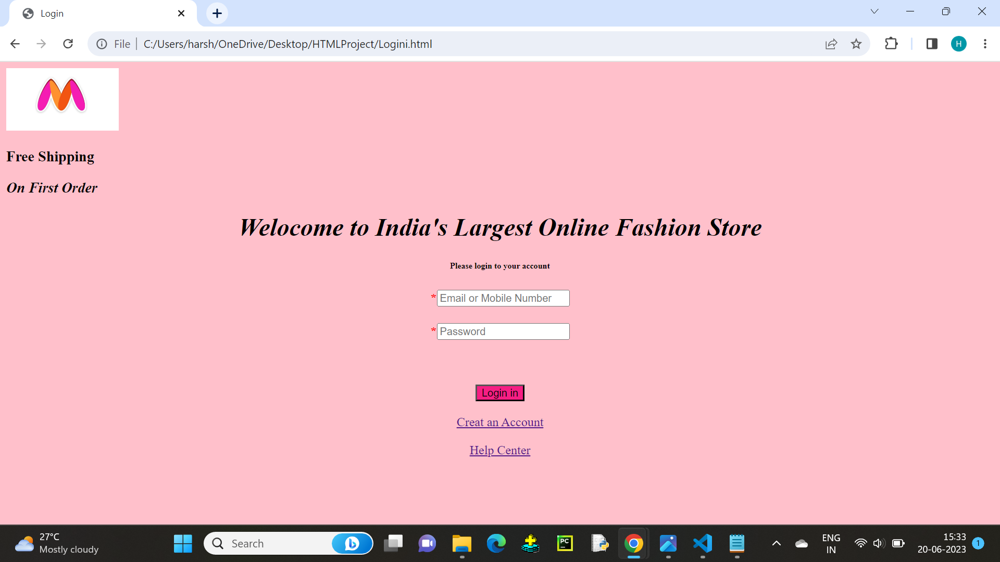
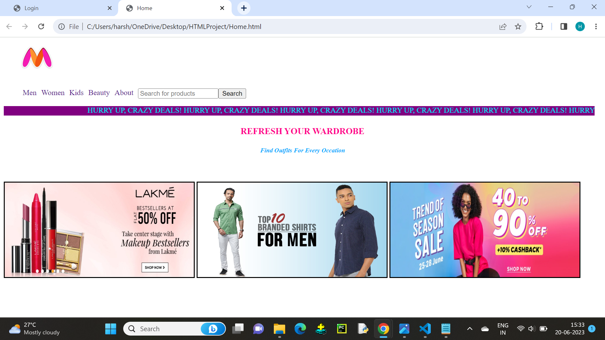
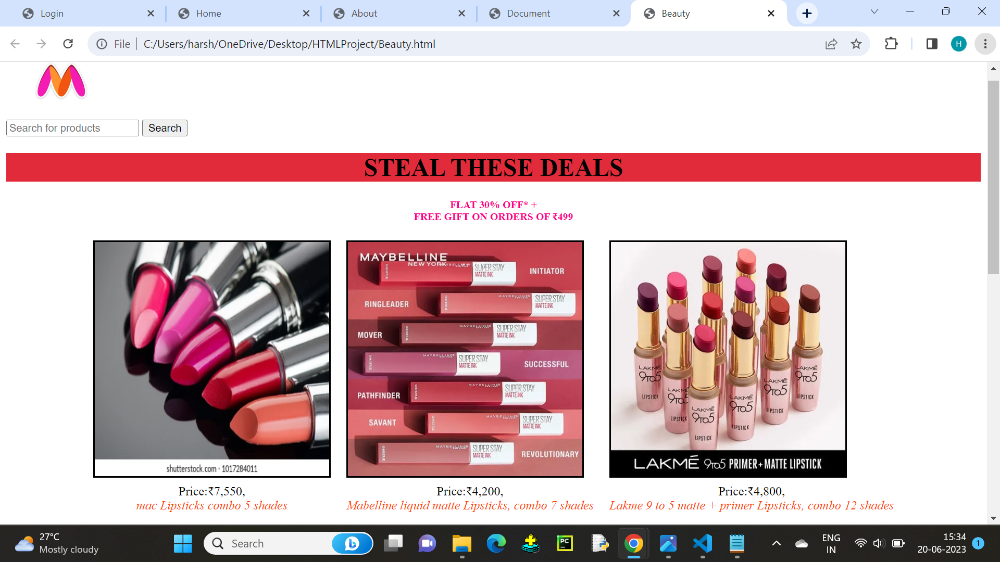
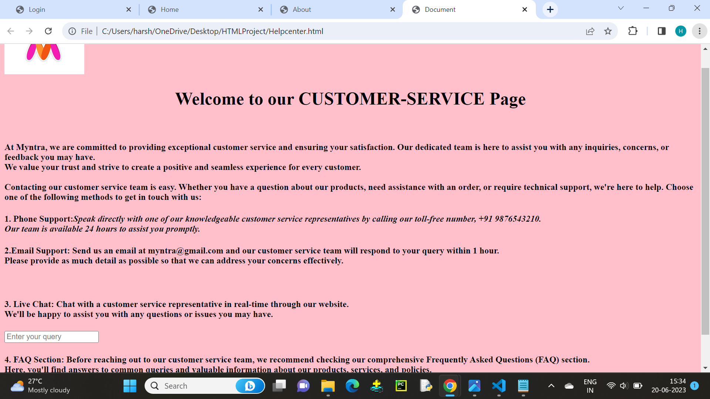

# Myntra Clone

Welcome to the Myntra Clone project! This project aims to recreate the Myntra website, an e-commerce clothing platform, using HTML, CSS, and JavaScript. It provides users with the ability to search and browse different categories of clothes and accessories. The project is designed to be a multi-page website, offering an interactive user experience.

## Technologies Used
- HTML
- CSS
- JavaScript

## Screenshots

## Usage
Browse the different categories of clothes and accessories.
Use the search feature to find specific items.
Interact with the website to explore its functionalities.

## Contributing
Contributions to the Myntra Clone project are welcome! If you would like to contribute, please follow these steps:

Fork the repository.
Create a new branch for your feature or bug fix.
Make your changes and commit them.
Push your changes to your forked repository.
Submit a pull request explaining your changes.
## License
This project is licensed under the MIT License.

## Acknowledgements
The Myntra Clone project was inspired by the original Myntra website.
We would like to express our gratitude to the developers and contributors of the open-source libraries and frameworks used in this project.
